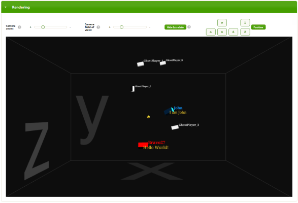

# Lightstreamer - 3D World Demo - HTML (Three.js) Client #

<!-- START DESCRIPTION lightstreamer-example-3dworld-client-javascript -->

This demo shows how well the real-time positions of objects in a multiplayer 3D world can be delivered over WebSockets and HTTP via Lightstreamer Server. Particular attention is paid to aspects of real-time communication and opportunities to minimize the network bandwidth utilization.

## Live Demo

### [ View live demo](http://demos.lightstreamer.com/3DWorldDemo)

## Details

__To fully understand this demo, please read the article__: [Optimizing Multiplayer 3D Game Synchronization Over the Web](http://blog.lightstreamer.com/2013/10/optimizing-multiplayer-3d-game.html)

There are two ways the demo can work.
- First way: the physics engine runs on the client side, which periodically synchronizes with the authoritative server. 
- Second way: the physics engine runs on the server side only and the positional and rotational data for all the players in a world are transmitted to all the clients. In other words, the clients are pure renderers.

This project includes the implementation of an HTML5 client for the demo. The page uses the <b>JavaScript Client API for Lightstreamer</b> to handle the communication with Lightstreamer Server.

### HTML Client

A simple HTML client with five panels: Identity, Tuning, Matrix, Commands, and Rendering. 
In the <b>Identity</b> panel, the player can configure their nickname, send messages to other users in the same world, and change the world where the player moves. 'Default' is the initial world where the player starts. 
In the <b>Tuning</b> panel, the user can choose the operating mode of the demo: client side or server side. In the first case, you can configure the maximum total bandwidth used by the entire page and the (server) resync frequency in the range from 1 per second to never. In the second mode, you can configure the max bandwidth allowed for the whole page, max frequency of updates for each player (from 1 per second to 100 per second). Here you can also choose the precision and format of the incoming data from the server. 
In the <b>Matrix</b> panel, the position of all the players in the same world is shown in a tabular view (your player data are in red, other active players are 
in blue, and automatic ghost players are in black). Data in this panel are always coming from the server in either mode of the demo. 
In the <b>Command</b> panel, you can find a recap of the commands that allow you to move the cuboid. The player can input the movement commands with these keys:
- "d": add +1 force impulse on axis X; 
- "a": add -1 force impulse on axis X; 
- "w": add +1 force impulse on axis Y; 
- "s": add -1 force impulse on axis Y; 
- "1": add +1 force impulse on axis Z; 
- "2": add -1 force impulse on axis Z;
- shift + "d": add +1 torque impulse on axis X;
- shift + "a": add -1 torque impulse on axis X;
- shift + "w": add +1 torque impulse on axis Y;
- shift + "s": add -1 torque impulse on axis Y;
- shift + "1": add +1 torque impulse on axis Z;
- shift + "2": add -1 torque impulse on axis Z.
 In the <b>Rendering</b> panel, the player can see a 3D rendering of the scene with all the players represented by cuboids. The origin of axes is marked with a yellow sphere and the edges of the world are outlined by white lines.
The 3D rendering is powered by [three.js library](http://mrdoob.github.com/three.js/).

The clients receive the real-time data by [subscribing](http://www.lightstreamer.com/docs/client_javascript_uni_api/Subscription.html) to Lightstreamer items, with a set of fields, using a subscription mode.

* There exists an item for each world in the game (actually, there is one item for each combination of world and representation precision, but let's keep the explanation simple). Such item works in <b>COMMAND</b> mode and delivers the dynamic list of players in that world, signaling players entering and leaving the world, in addition to notifying nickname changes and chat messages.

    The fields available for this item are: "key" (the unique identifier of each player), "command" (add, update, or delete), "nick" (the current nickname), and "msg" (the current chat message).
     
* For each player that enters a world, a specific item is created by the server (and subscribed by the clients) to carry all the real-time coordinates and movements for that player. This item works in <b>MERGE</b> mode and it is subscribed-to/unsubscribed-from by each client in that world, based on the commands received as part of the first item above.

    The fields available for this item are:

    - The coordinates and the quaternions, which represent the current position of the object: "posX", "posY", "posZ", "rotX", "rotY", "rotZ", "rotW". 
    This set of fields above is subscribed to in server-side mode, to get the actual positions in real-time and render the objects accordingly. It subscribed to in client-side as well, to get the periodic authoritative resynchronizations (unless the resync period is set to 'never').
    The matrix widget uses these fields to feed a Lightstreamer widget called [DynaGrid](http://www.lightstreamer.com/docs/client_javascript_uni_api/DynaGrid.html).

    - The velocity vector and the angular momentum, which represent the current movement of the object: "Vx", "Vy", "Vz", "momx", "momy", "momz". 
    This set of fields is subscribed to in client-side mode only, to receive the input for the client-side physics engine.
     
* Each client subscribes to an item in <b>DISTINCT</b> mode to implement presence. In other words, each player signals her presence by keeping this subscription active. By leaving the page, the automatic unsubscription determines the loss of presence, and the server can let all the other players know that the user has gone away (by leveraging the COMMAND-mode item above).
     
* Each client subscribes to an item in <b>MERGE</b> mode, to know the current downstream bandwidth (used by its own connection) in real-time.

<!-- END DESCRIPTION lightstreamer-example-3dworld-client-javascript -->

## Install
If you want to install a version of this demo pointing to your local Lightstreamer server, follow these steps:
* As prerequisite, the [3D World Demo - Java Adapter](https://github.com/Lightstreamer/Lightstreamer-example-3DWorld-adapter-java) has to be deployed in your local Lightstreamer server instance. Please check out that project and follow the installation instructions provided with it.
* Get the `lightstreamer.js` file from the [Lightstreamer distribution](http://www.lightstreamer.com/download) (see compatibility notes below) and put it in the `src/js` folder of the demo.
* Get the `require.js` file form the [requirejs.org](http://requirejs.org/docs/download.html) and put it in the `src/js` folder of the demo.
- Download [Three.js](http://github.com/mrdoob/three.js/zipball/master) and copy the `three.min.js` file to the `src/js` folder of the demo. The demo requires Three.js r61 or higher.
-  Please note that the demo uses a jQuery customized theme, included in this project.
* Deploy this demo on the Lightstreamer Server (used as Web server) or in any external Web Server. If you choose the former, please create the folder `<LS_HOME>/pages/demos/3DWorldDemo` and copy here the contents of the `/src` folder of this project.
The client demo configuration assumes that Lightstreamer Server, Lightstreamer Adapters, and this client are launched on the same machine. If you need to target a different Lightstreamer server, please search in `lsClient.js` this line:  `var lsClient = new LightstreamerClient(protocolToUse+"//localhost:8080","DEMOMOVE3D");`  and change it accordingly.
* Open your browser and point it to: [http://localhost:8080/demos/3DWorldDemo/](http://localhost:8080/demos/3DWorldDemo/)

## See Also

* [Optimizing Multiplayer 3D Game Synchronization Over the Web](http://blog.lightstreamer.com/2013/10/optimizing-multiplayer-3d-game.html)

### Lightstreamer Adapters Needed by This Client
<!-- START RELATED_ENTRIES -->

* [Lightstreamer - 3D World Demo - Java Adapter](https://github.com/Lightstreamer/Lightstreamer-example-3DWorld-adapter-java)

<!-- END RELATED_ENTRIES -->

### Related Projects

* [Lightstreamer - Basic Chat Demo - HTML Client](https://github.com/Lightstreamer/Lightstreamer-example-Chat-client-javascript)
* [Lightstreamer - Portfolio Demos - HTML Clients](https://github.com/Lightstreamer/Lightstreamer-example-Portfolio-client-javascript)
* [Lightstreamer - RSS News Demo - HTML Client](https://github.com/Lightstreamer/Lightstreamer-example-RSS-client-javascript)
* [Lightstreamer - Basic Stock-List Demo - Unity Client](https://github.com/Lightstreamer/Lightstreamer-example-StockList-client-unity)

## Lightstreamer Compatibility Notes #

- Compatible with Lightstreamer JavaScript Client library version 6.0 to 7.x.
