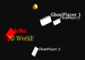

# Lightstreamer 3D World Demo Client for JavaScript #

This demo shows how well the real-time positions of objects in a multiplayer 3D world can be delivered over WebSockets and HTTP via Lightstreamer Server. Particular attention is paid to aspects of real-time communication and opportunities to minimize the network bandwidth utilization.

__To fully understand this demo, please read the article__: [Multiplayer 3D World Synchronization Through the Web](http://blog.lightstreamer.com/)

You can play online with the demo at [http://demos.lightstreamer.com/3DWorldDemo/](http://demos.lightstreamer.com/3DWorldDemo/)

There are two ways the demo can work.
- First way: the physics engine runs on the client side, which periodically synchronizes with the authoritative server. 
- Second way: the physics engine runs on the server side only and the positional and rotational data for all the players in a world are transmitted to all the clients. In other words, the clients are pure renderers.

This project includes the implementation of an HTML5 client for the demo. The page uses the <b>JavaScript Client API for Lightstreamer</b> to handle the communication with Lightstreamer Server.

## HTML Client ##

<table>
  <tr>
    <td style="text-align: left">
      &nbsp;<a href="http://demos.lightstreamer.com/3DWorldDemo" target="_blank"></a>&nbsp;
      
    </td>
    <td>
      &nbsp;An online demonstration is hosted on our servers at:<br>
      &nbsp;<a href="http://demos.lightstreamer.com/3DWorldDemo" target="_blank">http://demos.lightstreamer.com/3DWorldDemo</a>
    </td>
  </tr>
</table>

A simple HTML client with five panels: Identity, Tuning, Matrix, Commands, and Rendering.<br>
In the <b>Identity</b> panel, the player can configure their nickname, send messages to other users in the same world, and change the world where the player moves. 'Default' is the initial world where the player starts.<br>
In the <b>Tuning</b> panel, the user can choose the operating mode of the demo: client side or server side. In the first case, you can configure the maximum total bandwidth used by the entire page and the (server) resync frequency in the range from 1 per second to 1 every 20 seconds. In the second mode you can configure the max bandwidth allowed for the whole page, max frequency of updates for each player (from 1 per second to 100 per second). Here you can also choose the precision and format of the incoming data from the server.<br>
In the <b>Matrix</b> panel, the position of all the players in the same world is shown in a tabular view (your player data are in red, other active players are 
in blue, and automatic ghost players are in black). Data in this panel are always coming from the server in either mode of the demo.<br>
In the <b>Command</b> panel, you can find a recap of the commands that allow you to move the cuboid. The player can input the movement commands with these keys:
- "d": add +1 force impulse on axis X; 
- "a": add -1 force impulse on axis X; 
- "w": add +1 force impulse on axis Y; 
- "s": add -1 force impulse on axis Y; 
- "1": add +1 force impulse on axis Z; 
- "2": add -1 force impulse on axis Z;
- shift + "d": add +1 torque impulse on axis X;
- shift + "a": add -1 torque impulse on axis X;
- shift + "w": add +1 torque impulse on axis Y;
- shift + "s": add -1 torque impulse on axis Y;
- shift + "1": add +1 torque impulse on axis Z;
- shift + "2": add -1 torque impulse on axis Z.

<br>In the <b>Rendering</b> panel, the player can see a 3D rendering of the scene with all the players represented by cuboids. The origin of axes is marked with a yellow sphere and the edges of the world are outlined by white lines.
The 3D rendering is powered by [three.js library](http://mrdoob.github.com/three.js/).

The demo includes the following client-side technologies:

A Subscription to an item in MERGE mode, to get the downstream bandwidth in real time.

* A [Subscription](http://www.lightstreamer.com/docs/client_javascript_uni_api/Subscription.html)  to an item in <b>COMMAND</b> mode, to get the list of players in a world,
feeding a [DynaGrid](http://www.lightstreamer.com/docs/client_javascript_uni_api/DynaGrid.html) (for the matrix widget). Each added row automatically provokes an underlying subscription to a sub-item in <b>MERGE</b> mode, to get the real-time coordinates for that specific player. When a row is deleted, the underlying sub-item is automatically unsubscribed from.
* For each player in a world, a [Subscription](http://www.lightstreamer.com/docs/client_javascript_uni_api/Subscription.html) to an item in <b>MERGE</b> mode, with unlimited frequency, to receive the changes of the velocity vector and the angular momentum for all the objects in that world. These items are subscribed to only in client-side mode.
* A [Subscription](http://www.lightstreamer.com/docs/client_javascript_uni_api/Subscription.html)  to an item in <b>DISTINCT</b> mode, to implement presence (each player signals her presence by keeping this subscription; by closing the page, the automatic unsubscription determines the loss of presence).
* A [Subscription](http://www.lightstreamer.com/docs/client_javascript_uni_api/Subscription.html) to an item in <b>MERGE</b> mode, feeding a [StaticGrid](http://www.lightstreamer.com/docs/client_javascript_uni_api/StaticGrid.html), to get the downstream bandwidth in real time..


# Deploy #

Before you can run the demo, some dependencies need to be solved:

-  Get the lightstreamer.js file from the [Lightstreamer 5 Colosseo distribution](http://www.lightstreamer.com/download) 
   and put it in the src/js folder of the demo. Alternatively, you can build a lightstreamer.js file from the 
   [online generator](http://www.lightstreamer.com/distros/Lightstreamer_Allegro-Presto-Vivace_5_1_1_Colosseo_20130305/Lightstreamer/DOCS-SDKs/sdk_client_javascript/tools/generator.html).
   In that case, be sure to include the LightstreamerClient, Subscription, DynaGrid, and StatusWidget modules and to use the "Use AMD" version.
-  Get the require.js file form the [requirejs.org](http://requirejs.org/docs/download.html) and put it in the src/js folder of the demo.
-  Download [Three.js](http://github.com/mrdoob/three.js/zipball/master) and copy the three.min.js file to the src/js folder of the demo. The demo requires Three.js v.57 or higher.
-  Please note that the demo uses a jQuery customized theme, included in this project.

You can deploy this Demo in order to use the Lightstreamer server as a Web server too, or in any external Web Server you are running. 
If you choose the former case, create a "3DWorldDemo" folder in the <LS_HOME>/pages/demos folder and copy here all the files and subfolders from the src directory of this project. The client demo configuration assumes that Lightstreamer Server, Lightstreamer 3D World Adapter, and this client are launched on the same machine.
If you need to target a different Lightstreamer server, search this line in lsClient.js:
```js
var lsClient = new LightstreamerClient(protocolToUse+"//localhost:8080","DEMOMOVE3D");
```
and change it accordingly. 
In any case, the [3DWorldDemo Adapter Set](https://github.com/Weswit/Lightstreamer-example-3DWorld-adapter-java) have to be deployed in your local Lightstreamer server instance. Please check out that project and follow the installation instructions provided with it.
The demo is now ready to be launched. [Here](http://demos.lightstreamer.com/3DWorldDemo/) a demostration hosted on our servers.

# See Also #

## Explanatory Article ##

* [Multiplayer 3D World Synchronization Through the Web](http://blog.lightstreamer.com/)

## Lightstreamer Adapters needed by these demo client ##

* [Lightstreamer 3D World Demo Adapter](https://github.com/Weswit/Lightstreamer-example-3DWorld-adapter-java)

## Other demo clients that may interest you ##

* [Lightstreamer Chat Demo Client for JavaScript](https://github.com/Weswit/Lightstreamer-example-Chat-client-javascript)
* [Lightstreamer Portfolio Demo Client for JavaScript](https://github.com/Weswit/Lightstreamer-example-Portfolio-client-javascript)
* [Lightstreamer RSS Demo Client for JavaScript](https://github.com/Weswit/Lightstreamer-example-RSS-client-javascript)
* [Lightstreamer StockList Demo Client for Unity](https://github.com/Weswit/Lightstreamer-example-StockList-client-unity)

# Lightstreamer Compatibility Notes #

- Compatible with Lightstreamer JavaScript Client library version 6.0 or newer.
